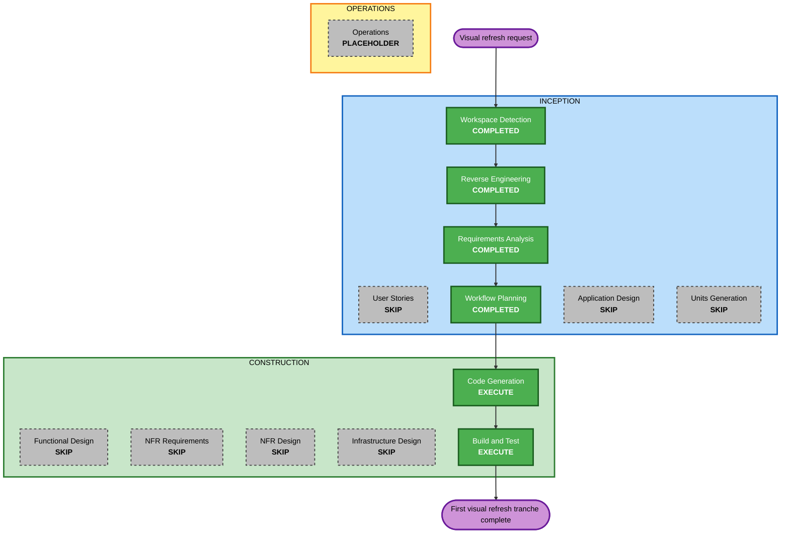

# Execution Plan

## Detailed Analysis Summary

### Transformation Scope (Brownfield Only)
- **Transformation Type**: UI enhancement across an existing brownfield frontend
- **Primary Changes**: premium visual refresh with richer movement, stronger hierarchy, more polished shared components, and higher-impact presentation in login, dashboard, and ventas
- **Related Components**:
  - `frontend/src/core/ConfigContext.jsx`
  - `frontend/src/App.jsx`
  - `frontend/src/features/auth/`
  - `frontend/src/features/dashboard/`
  - `frontend/src/features/ventas/`
  - `frontend/src/shared/components/`
  - `frontend/src/shared/lib/`

### Change Impact Assessment
- **User-facing changes**: Yes; login, navigation shell, widgets, product catalog, cart, dialogs, tables, and shared controls change visually
- **Structural changes**: Moderate; no architecture rewrite, but shared visual system and layouts evolve
- **Data model changes**: No
- **API changes**: No
- **NFR impact**: Yes; performance, perceived responsiveness, consistency, and visual clarity are directly affected

### Component Relationships (Brownfield Only)
- **Primary Component**: `frontend`
- **Infrastructure Components**: None
- **Shared Components**:
  - `frontend/src/shared/components/button/AppButton*`
  - `frontend/src/shared/components/table/AppTable*`
  - `frontend/src/shared/components/fields/*`
  - `frontend/src/shared/components/dialog/AppDialogHost*`
- **Dependent Components**:
  - `Login`
  - `Dashboard`
  - `Ventas`
- **Supporting Components**:
  - `ConfigContext` for branding and dynamic palette
  - global CSS tokens in `index.css` and `App.css`

### Risk Assessment
- **Risk Level**: Medium
- **Rollback Complexity**: Moderate
- **Testing Complexity**: Moderate
- **Reason**: the work is UI-only, but it touches shared styles and high-traffic screens. A weak implementation could create inconsistent visuals, layout regressions, or sluggish interactions.

## Workflow Visualization

### Text Alternative
- Inception already has enough context: workspace detection, reverse engineering, requirements analysis, and workflow planning are complete.
- User Stories are skipped because this tranche is a visual enhancement, not a new business capability or workflow redesign.
- Application Design and Units Generation are skipped because the architecture stays intact and the change can be executed as one coordinated frontend tranche.
- Construction will execute only Code Generation and Build and Test.

## Phases to Execute

### INCEPTION
- [x] Workspace Detection
- [x] Reverse Engineering
- [x] Requirements Analysis
- [ ] User Stories - SKIP
  - **Rationale**: this request changes presentation quality and interaction feel, but does not introduce new business journeys, personas, or feature scope that would benefit from formal stories.
- [x] Workflow Planning
- [ ] Application Design - SKIP
  - **Rationale**: no new services, components, or backend boundaries are required.
- [ ] Units Generation - SKIP
  - **Rationale**: the first tranche can be executed as one coordinated frontend effort with an internal implementation sequence.

### CONSTRUCTION
- [ ] Functional Design - SKIP
  - **Rationale**: there is no new business logic or schema behavior to design.
- [ ] NFR Requirements - SKIP
  - **Rationale**: the relevant NFRs are already captured in requirements and can be enforced directly during implementation.
- [ ] NFR Design - SKIP
  - **Rationale**: no separate NFR architecture is needed for this visual tranche.
- [ ] Infrastructure Design - SKIP
  - **Rationale**: no deployment or cloud changes are involved.
- [ ] Code Generation - EXECUTE
  - **Rationale**: implementation planning and UI changes are required across shared visual primitives and key screens.
- [ ] Build and Test - EXECUTE
  - **Rationale**: the tranche must be validated with the existing frontend checks and integration sanity across the updated screens.

### OPERATIONS
- [ ] Operations - PLACEHOLDER
  - **Rationale**: not applicable to this request.

## Module Update Strategy
- **Update Approach**: Sequential inside the frontend package
- **Critical Path**:
  1. shared visual foundation
  2. login
  3. dashboard shell and widgets
  4. ventas
- **Coordination Points**:
  - dynamic branding from `ConfigContext`
  - shared CSS tokens in `index.css`
  - shared component contracts (`AppButton`, `AppTable`, field controls, dialog host)
  - existing mobile and overlay behavior in dashboard and ventas
- **Testing Checkpoints**:
  - shared components compile and render correctly
  - login visual flow remains usable
  - dashboard navigation, widgets, and mobile shell remain stable
  - ventas catalog, cart, drawer, and step flow remain intact

## Package Change Sequence (Brownfield Only)
1. `frontend/src/index.css` and `frontend/src/App.css` - refine design tokens and app-level surfaces
2. `frontend/src/shared/components/` - buttons, fields, tables, dialogs
3. `frontend/src/features/auth/` - login experience
4. `frontend/src/features/dashboard/` - shell, widgets, navigation, landing
5. `frontend/src/features/ventas/` - product cards, cart, stepper, drawers, feedback

## Success Criteria
- **Primary Goal**: deliver a first visual refresh tranche that feels more premium, modern, and animated without changing backend behavior or breaking dynamic branding.
- **Key Deliverables**:
  - improved shared visual system
  - updated login
  - updated dashboard shell and widgets
  - updated ventas experience
  - preserved palette configurability
- **Quality Gates**:
  - visual consistency across the touched surfaces
  - no hardcoded replacement of the DB-driven color palette
  - movement implemented where it adds polish, not noise
  - existing frontend validation commands still pass

## Extension Compliance

### Security Compliance
| Rule | Status | Notes |
|---|---|---|
| SECURITY-01 | N/A | No persistence or transport layer changes are planned. |
| SECURITY-02 | N/A | No network intermediaries are involved. |
| SECURITY-03 | N/A | This stage plans UI changes only; logging behavior is unchanged. |
| SECURITY-04 | N/A | No HTTP header or HTML-serving middleware changes are planned in this tranche. |
| SECURITY-05 | N/A | No API input contract changes are planned. |
| SECURITY-06 | N/A | No IAM or backend permission scope changes are planned. |
| SECURITY-07 | N/A | No network configuration changes are planned. |
| SECURITY-08 | Compliant | The plan explicitly avoids replacing server-side controls with client-side gating and limits work to presentation changes. |
| SECURITY-09 | Compliant | The plan avoids exposing internals and does not introduce insecure defaults. |
| SECURITY-10 | N/A | Supply-chain hardening is outside this visual tranche. |
| SECURITY-11 | Compliant | Security-critical logic remains isolated; the plan targets presentation and shared styling only. |
| SECURITY-12 | N/A | Auth flows are restyled, not redefined. |
| SECURITY-13 | N/A | No artifact integrity or audit model changes are planned here. |
| SECURITY-14 | N/A | No alerting or monitoring changes are planned. |
| SECURITY-15 | Compliant | The plan does not weaken fail-safe behavior or error handling paths. |

### PBT Compliance
| Rule | Status | Notes |
|---|---|---|
| PBT-01 | N/A | No functional design stage is executed for this tranche. |
| PBT-02 | N/A | No round-trip transformations are introduced. |
| PBT-03 | N/A | No invariant-heavy business logic is introduced. |
| PBT-04 | N/A | No idempotent algorithm or API behavior changes are planned. |
| PBT-05 | N/A | No oracle/model-based algorithm work is planned. |
| PBT-06 | N/A | No new stateful model testing scope is introduced. |
| PBT-07 | N/A | No PBT generators are introduced in this stage. |
| PBT-08 | N/A | No PBT execution is introduced in this stage. |
| PBT-09 | N/A | No PBT framework selection is part of this visual tranche. |
| PBT-10 | N/A | No new test strategy is introduced in Workflow Planning. |
