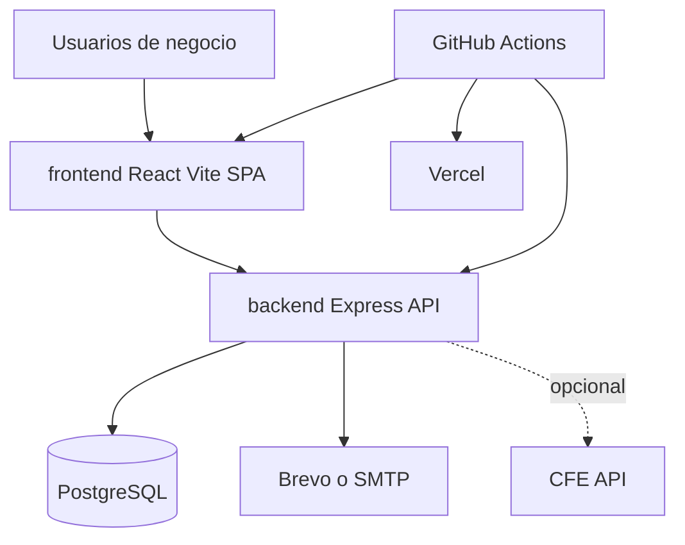
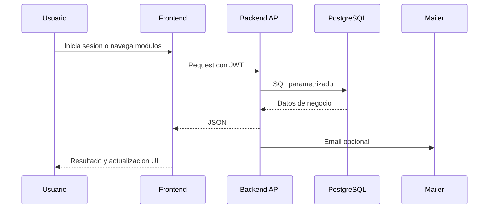

# System Architecture

## System Overview
Ferco esta organizado como una aplicacion web brownfield con dos paquetes principales: un frontend React/Vite y un backend Express conectado a PostgreSQL. El frontend usa una SPA sin React Router y consume una API REST bajo `/api/*`. El backend concentra autenticacion JWT, logica de ventas, inventario, clientes, permisos, configuracion, auditoria y soporte para correo/CFE.

## Architecture Diagram

### Text Alternative
- Los usuarios interactuan con una SPA React.
- La SPA llama al backend Express por HTTP.
- El backend usa PostgreSQL como base primaria.
- El backend integra correo y una API externa de CFE.
- GitHub Actions valida, libera y dispara despliegues.

## Component Descriptions

### Root release workspace
- **Purpose**: centralizar automatizacion de release y documentacion operativa.
- **Responsibilities**: semantic-release, workflows de CI/release y scripts de setup.
- **Dependencies**: Node.js, semantic-release, GitHub Actions.
- **Type**: Application support

### frontend
- **Purpose**: interfaz de usuario para operacion diaria del negocio.
- **Responsibilities**: login, setup inicial, dashboard, CRUDs y consultas.
- **Dependencies**: React 19, Vite 8, react-icons, jsPDF, API backend.
- **Type**: Application

### backend
- **Purpose**: exponer servicios REST y ejecutar logica transaccional.
- **Responsibilities**: autenticacion JWT, reglas de inventario/ventas, permisos, auditoria e integraciones.
- **Dependencies**: Express 4, pg, jsonwebtoken, bcryptjs, nodemailer, PostgreSQL.
- **Type**: Application

### PostgreSQL
- **Purpose**: persistencia transaccional.
- **Responsibilities**: catalogos, ventas, usuarios, configuracion y auditoria.
- **Dependencies**: consultas SQL parametrizadas desde backend.
- **Type**: Data store

## Data Flow

### Key Business Transaction Flow
1. El usuario inicia una venta desde el dashboard.
2. El frontend envia la orden al backend con el JWT almacenado.
3. El backend valida permisos, consulta datos y ejecuta la transaccion SQL.
4. Se registran movimientos de stock y auditoria.
5. La respuesta vuelve al frontend y puede disparar correo o CFE segun configuracion.

## Integration Points
- **External APIs**:
  - **CFE API**: envio de comprobantes fiscales cuando la integracion esta configurada.
- **Databases**:
  - **PostgreSQL**: almacenamiento principal del sistema.
- **Third-party Services**:
  - **Brevo/SMTP**: envio de emails de recuperacion y comunicaciones de ventas.
  - **Vercel Deploy Hook**: redeploy del frontend tras releases.

## Infrastructure Components
- **CDK Stacks**: no se detectaron.
- **Deployment Model**: frontend estatico generado con Vite y backend Node/Express desplegable por separado.
- **Networking**: configuracion basada en variables de entorno para CORS, correo, JWT y servicios externos; no hay definiciones de infraestructura como codigo en el repositorio.
