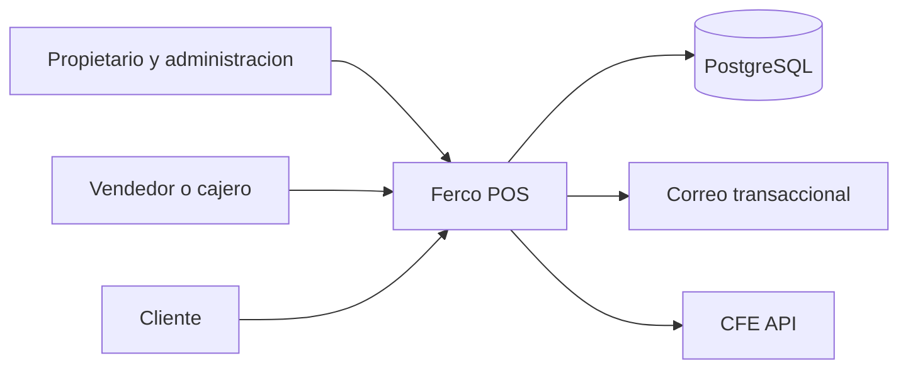

# Business Overview

## Business Context Diagram

### Text Alternative
- Propietario y vendedores operan Ferco POS.
- El sistema persiste datos en PostgreSQL.
- El sistema envia correos transaccionales y puede integrarse con un servicio externo de CFE.

## Business Description
- **Business Description**: Ferco es una aplicacion web para una ferreteria que centraliza ventas, inventario, clientes, usuarios, configuracion comercial, auditoria y facturacion electronica.
- **Business Transactions**:
  - **Venta mostrador**: registrar una venta, validar stock, calcular precios e impuestos, descontar inventario y guardar el comprobante.
  - **Gestion de productos**: alta, edicion, baja logica y ajuste de stock de productos y empaques.
  - **Gestion de clientes**: alta y mantenimiento de clientes, ubicaciones y datos fiscales.
  - **Administracion de usuarios**: login, cambio de password, recuperacion, roles y permisos.
  - **Configuracion del negocio**: datos de empresa, modulos habilitados y parametros de ganancias.
  - **Auditoria operativa**: consulta de eventos y movimientos de stock.
  - **Emision y envio de CFE**: construccion de payload fiscal y opcion de envio o anotacion.
- **Business Dictionary**:
  - **Producto**: articulo vendible con stock y precio.
  - **Empaque**: presentacion o unidad comercial del producto.
  - **Venta**: transaccion comercial registrada en el sistema.
  - **Movimiento de stock**: ajuste derivado de ventas o cambios manuales.
  - **Cliente**: comprador con datos de contacto y fiscales.
  - **CFE**: comprobante fiscal electronico.
  - **Permiso**: autorizacion por rol para operar funcionalidades.

## Component Level Business Descriptions

### Frontend SPA
- **Purpose**: interfaz operativa para vendedores, administradores y configuracion inicial.
- **Responsibilities**: autenticacion, navegacion entre modulos, formularios CRUD, visualizacion de dashboards y consumo de API.

### Backend API
- **Purpose**: capa central de negocio y persistencia.
- **Responsibilities**: exponer endpoints REST, validar tokens, ejecutar reglas de ventas e inventario, enviar correos y registrar auditoria.

### PostgreSQL
- **Purpose**: almacenamiento transaccional del negocio.
- **Responsibilities**: guardar catalogos, ventas, clientes, usuarios, configuraciones, auditoria y movimientos de stock.

### Integraciones externas
- **Purpose**: extender operaciones fuera del sistema principal.
- **Responsibilities**: envio de email mediante Brevo/SMTP y soporte para envio de CFE a una API externa.
