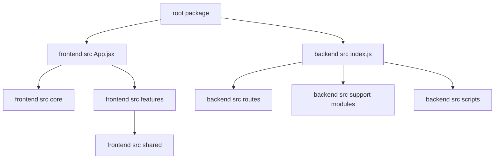

# Code Structure

## Build System
- **Type**: npm en tres niveles (root, frontend y backend)
- **Configuration**:
  - `package.json` raiz: release automation con semantic-release.
  - `frontend/package.json`: dev, build, lint y preview con Vite.
  - `backend/package.json`: arranque, watch y scripts de esquema/migraciones/dumps.

## Key Modules

### Text Alternative
- El root contiene tooling de release.
- El frontend se divide en `core`, `features` y `shared`.
- El backend parte de `index.js` y delega a `routes`, modulos auxiliares y `scripts`.

## Existing Files Inventory

### Root and operational files
- `package.json` - release automation del repositorio.
- `.releaserc.json` - configuracion de semantic-release.
- `CONTRIBUTING.md` - flujo de ramas y validaciones locales.
- `SETUP_INSTRUCTIONS.md` - onboarding, variables y scripts.
- `CLAUDE.md` - resumen arquitectonico del proyecto.
- `setup-runner.js` y scripts `setup-*` - automatizacion de inicializacion y branding.

### Frontend source structure
- `frontend/src/App.jsx` - bootstrap de la SPA, auth restore y cambio de pantalla.
- `frontend/src/main.jsx` - punto de entrada React.
- `frontend/src/core/api.js` - wrapper central de fetch y endpoints.
- `frontend/src/core/ConfigContext.jsx` - carga de configuracion y tema.
- `frontend/src/core/PermisosContext.jsx` - permisos y helpers `can()`.
- `frontend/src/features/auth/` - login y recuperacion de password.
- `frontend/src/features/setup/` - wizard de configuracion inicial.
- `frontend/src/features/dashboard/` - shell principal y navegacion interna.
- `frontend/src/features/productos/` - CRUD y vistas de productos.
- `frontend/src/features/ventas/` - flujo de ventas e historial.
- `frontend/src/features/clientes/` - mantenimiento de clientes.
- `frontend/src/features/usuarios/` - gestion de usuarios.
- `frontend/src/features/auditoria/` - consultas de auditoria.
- `frontend/src/features/configuracion/` - empresa, modulos y ganancias.
- `frontend/src/features/estadisticas/` - indicadores y reportes.
- `frontend/src/features/stock/` - herramientas asociadas a stock.
- `frontend/src/shared/components/` - botones, campos, tablas, dialogos, menu y PWA.
- `frontend/src/shared/lib/` - helpers de dialogos, mapeos y configuracion visual.

### Backend source structure
- `backend/src/index.js` - servidor Express, CORS, healthcheck y montaje de rutas.
- `backend/src/auth.js` - validacion JWT y roles.
- `backend/src/db.js` - creacion del `pg.Pool`.
- `backend/src/dbErrors.js` - normalizacion de errores SQL.
- `backend/src/gananciaCalculator.js` - calculos de margenes y ganancias.
- `backend/src/mailer.js` - envio de correos via Brevo o SMTP.
- `backend/src/cfeBuilder.js` - armado de payload CFE.
- `backend/src/cfeAnnotated.js` - soporte de CFE anotado.
- `backend/src/cfeSender.js` - cliente HTTP para CFE externo.
- `backend/src/routes/productos.js` - catalogo, stock y auditoria de productos.
- `backend/src/routes/ventas.js` - ventas, dashboard, entregas, emails y CFE.
- `backend/src/routes/clientes.js` - CRUD de clientes.
- `backend/src/routes/usuarios.js` - login, perfil y reseteo de password.
- `backend/src/routes/auditoria.js` - consultas de auditoria y movimientos.
- `backend/src/routes/configuracion.js` - empresa, modulos y ganancias.
- `backend/src/routes/permisos.js` - roles y permisos.
- `backend/src/routes/ubicaciones.js` - departamentos y barrios.
- `backend/src/routes/tipos-iva.js` - catalogo de IVA.
- `backend/src/routes/empaques.js` - catalogo de empaques.
- `backend/src/scripts/bootstrapSchema.js` - creacion de tablas base.
- `backend/src/scripts/runMigration.js` - migraciones aditivas.
- `backend/src/scripts/exportDump.js` - exportacion SQL.
- `backend/src/scripts/importDump.js` - restauracion SQL.
- `backend/src/scripts/seedClientesVentasTest.js` - carga de datos de prueba.

## Design Patterns

### SPA Screen Switching
- **Location**: `frontend/src/App.jsx`, `frontend/src/features/dashboard/`
- **Purpose**: manejar navegacion sin router.
- **Implementation**: estado local `pantalla` y eventos custom para navegar o refrescar widgets.

### API Wrapper
- **Location**: `frontend/src/core/api.js`
- **Purpose**: centralizar headers JWT, parsing de respuestas y endpoints REST.
- **Implementation**: helper `apiFetch` con funciones exportadas por recurso.

### Route-per-domain
- **Location**: `backend/src/routes/`
- **Purpose**: separar funcionalidades por dominio de negocio.
- **Implementation**: un modulo Express Router por recurso.

### Raw SQL with shared Pool
- **Location**: `backend/src/db.js`, modulos en `backend/src/routes/`
- **Purpose**: acceso directo a PostgreSQL sin ORM.
- **Implementation**: `pg.Pool` compartido y consultas parametrizadas inline.

## Critical Dependencies

### React
- **Version**: 19.2.4
- **Usage**: UI SPA del frontend.
- **Purpose**: renderizado y estado de componentes.

### Vite
- **Version**: 8.0.1
- **Usage**: desarrollo y build del frontend.
- **Purpose**: bundling y servidor dev.

### Express
- **Version**: 4.21.2
- **Usage**: API backend.
- **Purpose**: routing HTTP y middleware.

### pg
- **Version**: 8.16.3
- **Usage**: acceso a PostgreSQL.
- **Purpose**: consultas SQL y pool de conexiones.

### semantic-release
- **Version**: 24.2.7
- **Usage**: automatizacion de versionado desde root.
- **Purpose**: publicaciones y changelog basados en Conventional Commits.
