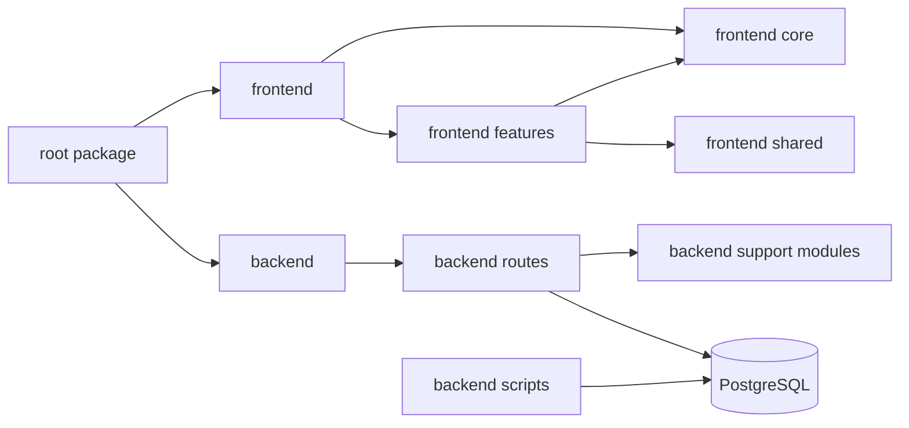

# Dependencies

## Internal Dependencies

### Text Alternative
- El root gobierna el release de `frontend` y `backend`.
- El frontend depende de `core` y `shared`.
- El backend depende de rutas, modulos auxiliares y PostgreSQL.
- Los scripts operativos actuan directamente sobre la base.

### frontend depends on backend
- **Type**: Runtime
- **Reason**: la SPA consume la API REST para autenticar, consultar y mutar datos.

### frontend features depends on frontend core
- **Type**: Runtime
- **Reason**: acceso al wrapper API, configuracion y permisos globales.

### frontend features depends on frontend shared
- **Type**: Runtime
- **Reason**: reutiliza componentes, dialogos y helpers visuales.

### backend routes depends on backend support modules
- **Type**: Runtime
- **Reason**: autenticacion, DB pool, CFE, mail y calculos auxiliares.

### backend routes depends on PostgreSQL
- **Type**: Runtime
- **Reason**: persistencia y consultas del negocio.

## External Dependencies

### React
- **Version**: 19.2.4
- **Purpose**: SPA del frontend.
- **License**: MIT

### react-dom
- **Version**: 19.2.4
- **Purpose**: renderizado del frontend en DOM.
- **License**: MIT

### react-icons
- **Version**: 5.5.0
- **Purpose**: iconografia UI.
- **License**: MIT

### jsPDF
- **Version**: 4.2.1
- **Purpose**: generacion de PDFs en frontend.
- **License**: MIT

### Express
- **Version**: 4.21.2
- **Purpose**: routing y middleware backend.
- **License**: MIT

### pg
- **Version**: 8.16.3
- **Purpose**: conectividad PostgreSQL.
- **License**: MIT

### jsonwebtoken
- **Version**: 9.0.2
- **Purpose**: firma y verificacion JWT.
- **License**: MIT

### bcryptjs
- **Version**: 2.4.3
- **Purpose**: hashing de passwords.
- **License**: MIT

### nodemailer
- **Version**: 6.9.15
- **Purpose**: fallback SMTP para correos.
- **License**: MIT

### semantic-release
- **Version**: 24.2.7
- **Purpose**: release automation.
- **License**: MIT
